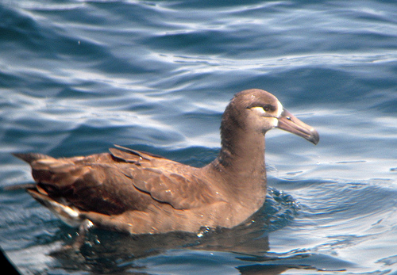
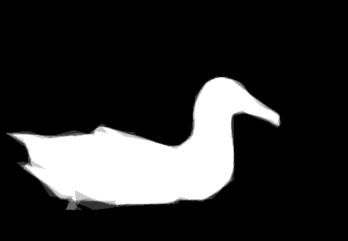

# Birds Segmentation (CV course project)

This project implements **binary segmentation of birds in natural images** using a UNet-based architecture with a ResNet-18 encoder. The solution was built for a computer vision course as a semester assignment.

---

## 🧠 Overview

- 💡 Goal: Segment bird silhouettes on image data (binary masks)
- 🏗️ Model: UNet with ResNet-18 encoder
- 🧪 Frameworks: PyTorch Lightning, Albumentations, OpenCV
- 🧾 Includes: training pipeline, evaluation script, test runner, automatic IoU grading

---

## 📁 Structure

- `segmentation.py` — training & inference pipeline with UNet and PyTorch Lightning
- `run.py` — runner script for local and automatic testing (CLI interface)
- `segmentation_model.pth` — (expected) saved model file

---

## 🧪 Features

- BCE + Dice loss function
- ResNet-18 encoder (frozen during training)
- Augmentations via Albumentations
- Custom IoU-based grading system
- Automatic model saving and early stopping
- Inference with optional resizing and thresholding

---

## 🚀 Quick Start

### ⚙️ Installation

```bash
git clone https://github.com/your-username/birds-segmentation.git
cd birds-segmentation
pip install -r requirements.txt
```

### 🏋️ Training

```python
from segmentation import train_segmentation_model

train_segmentation_model("path_to_data/train")
```

### 🔍 Inference

```python
from segmentation import get_model, predict

model = get_model()
model.load_state_dict(torch.load("segmentation_model.pth"))

mask = predict(model, "some/image.jpg")
```

---

## 🧪 Test & Evaluation

```bash
python run.py tests
```

This script automatically:
- Applies inference to all test images
- Computes mean IoU
- Assigns a score from 0 to 10 based on quality

---

## 🧾 Grading Criteria

| IoU Range  | Score |
|------------|-------|
| ≥ 0.85     | 10    |
| 0.80–0.85  | 9     |
| 0.75–0.80  | 8     |
| ...        | ...   |
| < 0.20     | 0     |

---

## 📷 Example Result

 

---

## 🧠 Author

Murad Bagamaev  
Email: true.barsuk@yandex.ru  
GitHub: [github.com/JokerLord](https://github.com/JokerLord)
